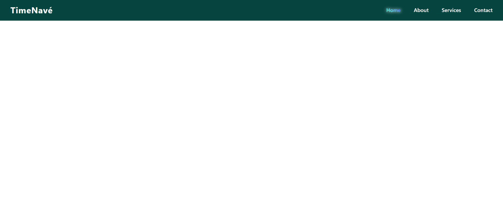

# TimeNavé

A futuristic, lightsaber-inspired responsive navigation bar — built with pure HTML, CSS, and JavaScript.  
Elegant, animated, and engineered to glow.

---

### Live Preview

🍃  **[View Live on GitHub Pages](https://ricoaprillananda.github.io/TimeNave/)**

---

### Previews

#### Desktop View


---

### Features

-  Rainbow hover effect (lightsaber-inspired)
-  Fully responsive: desktop and mobile
-  Hamburger menu transforms into X with glow
-  Glowing effects on hover and toggle
-  Smooth horizontal dividers between menu items
-  Clean, modern UI with futuristic energy

---

### Tech Stack

```

- **HTML5**
- **CSS3** (Flexbox, Media Queries, Keyframes)
- **Vanilla JavaScript**

```

---

### 🛠 How to Use

```

1. Clone this repo:
   ```bash
   git clone https://github.com/ricoaprillananda/TimeNave.git

```
  

---

💎 Designed & Engineered by


🍃 Rico Aprilla Nanda
Frontend Engineer • UI/UX Futurist • Lightsaber Coder

🌑 Evelyn
Creative Director • System Architect • Mysterious Partner
"Her presence is unseen, but her signature glows in every detail."

